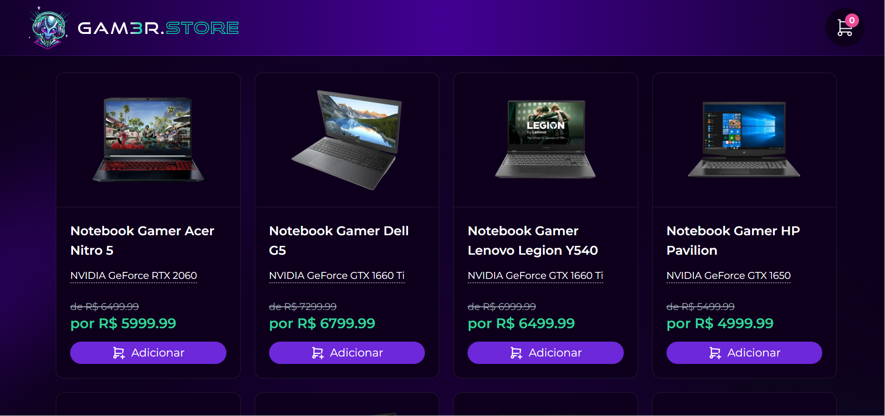

# E-commerce de Gamer 

Esse é um projeto Loja de Gamer Ficticia  
Esse projeto é o desenvolvimento de um Front-End  com Next e Back end com Nest

Desenvolvido na semana do dev da Formação Dev 

# Imagem do projeto

# site do projeto

<!--  Em breve -->

## Principais Tecnologias 🚀

# Principais Tecnologias Front-End 🚀
-  **Next.js** 
- **Tailwind CSS**

# Principais Tecnologias Back-End 🚀

- **Nest** 
- **Postgres**

## Repositorio do Projeto para clonar
git clone https://github.com/JacquelineCasali/e-commece-react-next-bd

ou 
Seleciona o botão code vai na opção Download ZIP

## Rodar o Projeto no FrontEnd 

-  cd frontEnd
-  npm install
-  npm run dev

## Rodar o Projeto no BackEnd 

-  cd backend
-  npm install
-  npm run dev

<!-- - **Prisma**: Um ORM (Object-Relational Mapping) para Node.js e TypeScript. -->

<!-- - **shadcn/ui**: Uma biblioteca de componentes de IU reutilizáveis e estilizáveis. -->

<!-- - **API do Stripe**: Uma API de pagamento popular para processar pagamentos online de forma segura. -->

